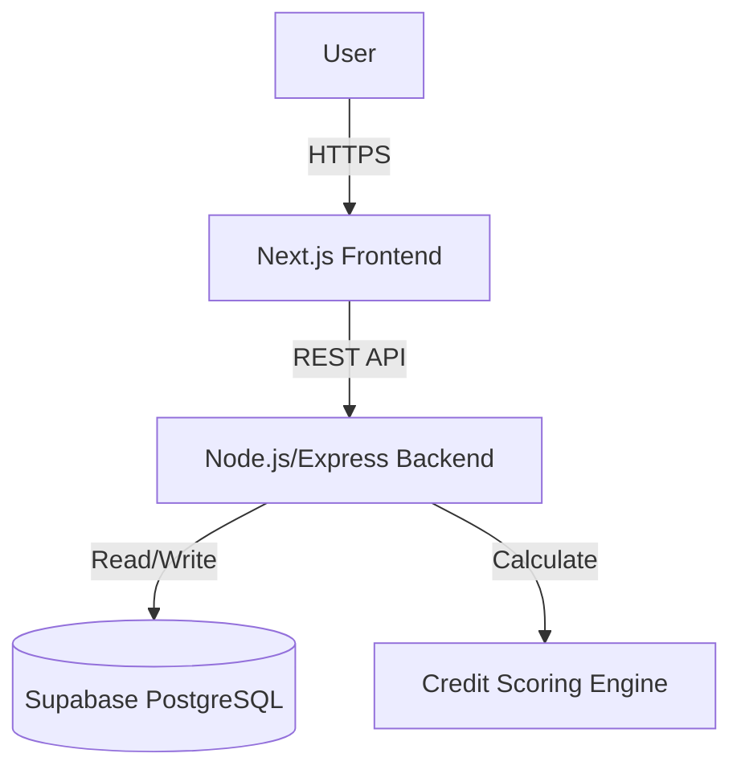
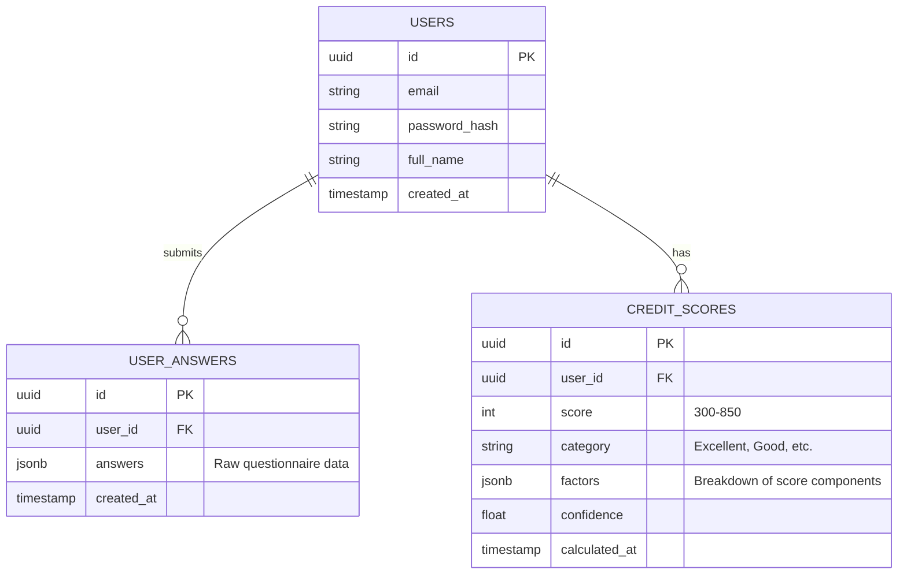

# AltCred System Architecture

## 1. High-Level Overview

AltCred follows a modern **Client-Server** architecture, utilizing a decoupled Frontend and Backend communicating via RESTful APIs. The system leverages **Supabase** (PostgreSQL) for persistence and a custom **Node.js-based ML Engine** for credit scoring.

## 2. Frontend Architecture

*   **Framework**: Next.js (Pages Router)
*   **Styling**: Tailwind CSS + CSS Modules
*   **State Management**: React `useState` / `useEffect` + LocalStorage (for Auth Tokens)
*   **Routing**: File-based routing (`src/pages`)

### Key Components
*   **Pages**: `index.js` (Landing), `login.js`, `signup.js`, `dashboard.js`, `financial-assessment.js`
*   **Components**: `Navbar`, `QuestionCard`
*   **Utils**: `api.js` (Axios-like wrapper for fetch), `auth.js` (Token management)

## 3. Backend Architecture

The backend follows a **Modular Monolith** structure with a clear separation of concerns (Controller-Service Pattern).

### Directory Structure (`src/modules/`)
Each feature (Auth, Intake, Credit Score) has its own module containing:
*   **Routes**: Defines API endpoints (`*.routes.js`)
*   **Controllers**: Handles HTTP requests/responses (`*.controller.js`)
*   **Services**: Contains business logic (`*.service.js`)
*   **Validators**: Input validation logic (`*.validator.js`)

### Core Modules
1.  **Auth Module**: Handles Registration, Login, and JWT issuance.
2.  **Intake Module**: Manages the collection and storage of financial assessment answers.
3.  **Credit Score Module**:
    *   **Feature Engineering**: Transforms raw answers into numerical vectors.
    *   **ML Model**: Applies weighted algorithms to calculate the final score (300-850).

## 4. Database Schema (Supabase)

The system uses a relational database with the following key tables:

## 5. Credit Scoring Logic

The scoring engine uses a **Weighted Factor Model** designed to assess creditworthiness based on alternative data.

### Scoring Pillars
1.  **Payment History (35%)**:
    *   *Inputs*: Past loan repayment behavior, Bill payment discipline.
2.  **Financial Stability (25%)**:
    *   *Inputs*: Savings buffer (months of expenses), Monthly expense ratio.
3.  **Income Factors (20%)**:
    *   *Inputs*: Monthly income amount, Income stability (Fixed vs. Variable).
4.  **Responsibility (20%)**:
    *   *Inputs*: Education level, Number of dependents, Employment stability.

### Calculation Flow
1.  **Input**: Raw user answers from `user_answers` table.
2.  **Feature Engineering**: Map categorical answers (e.g., "Fixed Income") to numerical values (0.0 - 1.0).
3.  **Weighted Sum**: `Score = Σ (Feature_Value × Weight)`.
4.  **Scaling**: Map the raw weighted sum (0-100) to the FICO range (300-850).
5.  **Output**: Final Score + Factor Breakdown.

## 6. Security

*   **Authentication**: JWT (Access Token + Refresh Token).
*   **Password Storage**: Bcrypt hashing.
*   **API Security**:
    *   `Helmet`: Sets secure HTTP headers.
    *   `CORS`: Restricts access to allowed frontend origins.
    *   `Rate Limiting`: Prevents abuse.
*   **Environment Variables**: Secrets (DB keys, JWT secrets) are stored in `.env` and never committed.
